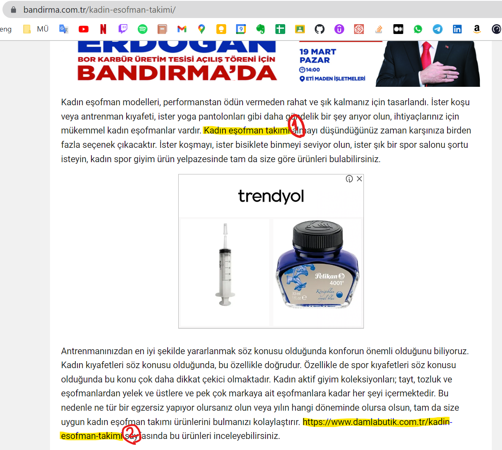
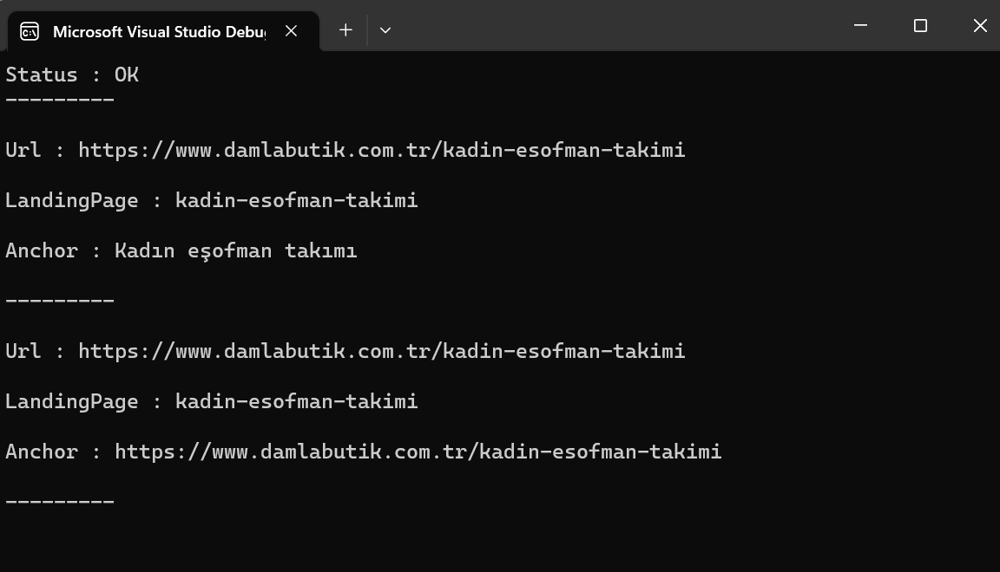

# Web Link Searcher

This is a simple web link searcher that uses the [Google Custom Search API](https://developers.google.com/custom-search/v1/overview) to search for links on the web.

This console app read a page and search for links on the web. Using HttpClient library and using regex to find the links.

## Screenshots

we want to find  marked links on this page

Here is the result 
